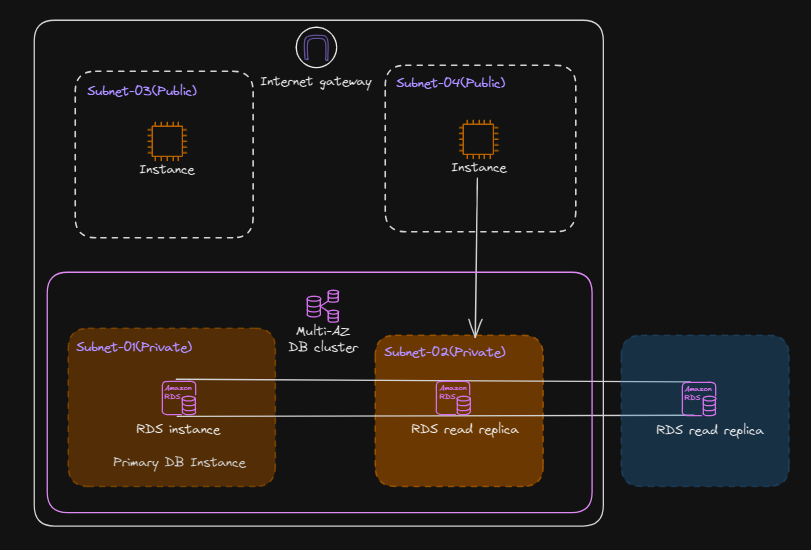
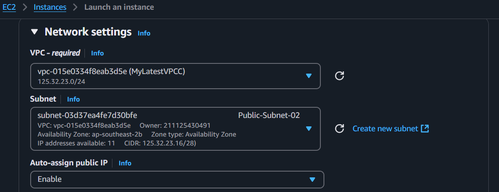
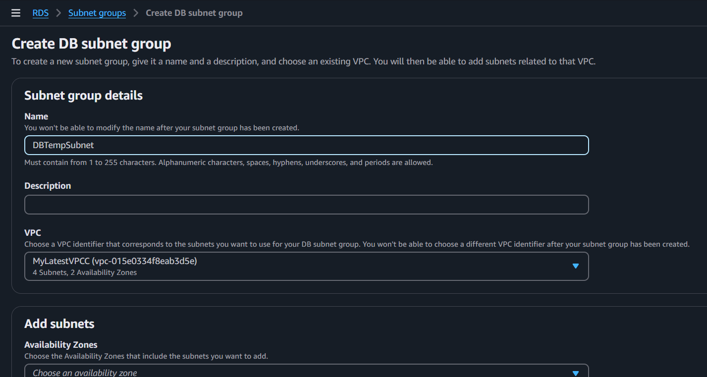
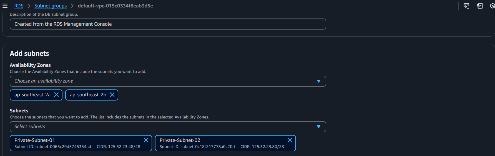
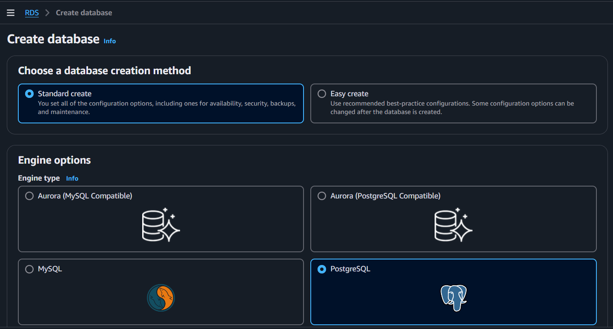
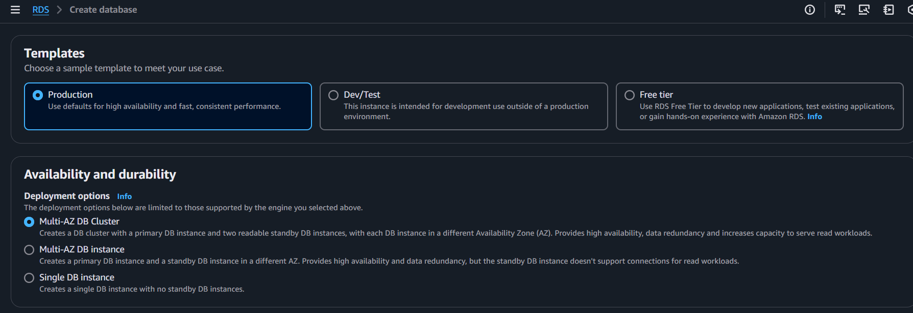
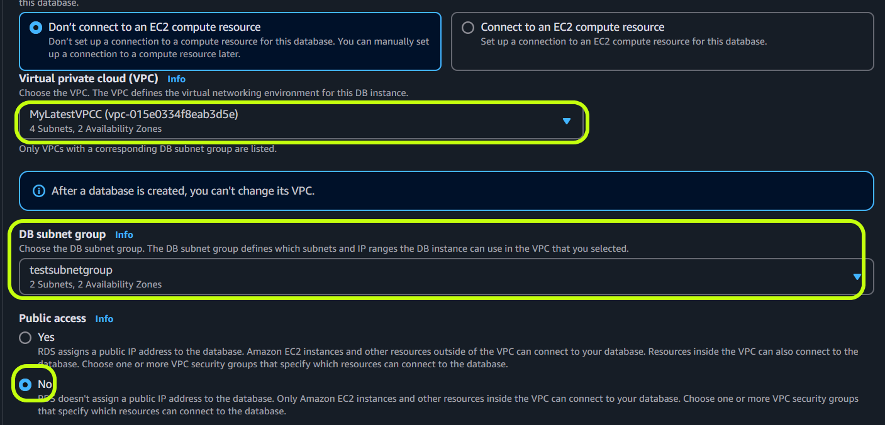
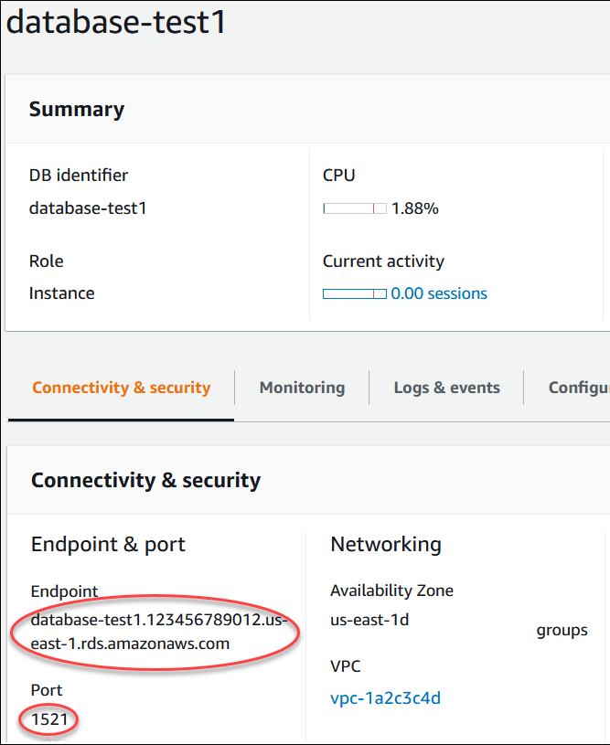

# Create RDS Instance

# Pre-Requisite

* An AWS Account with access
* Gitbash

# Problem Context

* Create a RDS Database instance and connect it to the ec2 instance

# Proposed Solution

## Step - 01: Create a VPC and its subnets

* Log in to the AWS account
* Go To AWS console, search for VPC, Create VPC
* We give the VPC name
* Give CIDR 125.32.23.0/24

* In the VPC, tap for subnets in the Left Hand Side
* Select the VPC, that you have created
* Give the Name as, *Public-Subnet-01*, the AZ as *ap-southeast-2a*
* Give the cidr *125.32.23.7/28*, (ranges 125.32.23.0 - 125.32.23.15)

* Create subnet, of name *Public-Subnet-02*, the AZ as *ap-southeast-2b* and cidr *125.32.23.17/28*
* Create subnet, of name *Private-Subnet-01*, the AZ as *ap-southeast-2a* and cidr *125.32.23.80/28*
* Create subnet, of name *Private-Subnet-02*, the AZ as *ap-southeast-2b* and cidr *125.32.23.48 /28*

* In the Left Hand Side, tap on Internet gateway and Attach it to the VPC you have created
* Tap on the Route Table in the VPC dashboard
* Give name **My-Test-Route-Table**, choose the VPC you have created
* This Route table will be used to access the Public Subnets to Internet Gateway
* Tap on the route table name in the route table dashboard
* Below the page, tap on the subnet association
    - Tap **Edit Subnet Association**
    - Select the **Public-Subnet-01**, **Public-Subnet-02** and then save associations
* Now move to the route table details page, and from the bottom select **Routes**
* Tap **Edit Routes**, the add a route keeping destination at 0.0.0.0/0 and for the Target select the Internet Gateway that was created previously
* Create Route Table for Private Subnet by name **My-Private-Route**
* Tap on the route table name in the route table dashboard
* Below the page, tap on the subnet association
    - Tap **Edit Subnet Association**
    - Similarly, Select the **Private-Subnet-01**, **Private-Subnet-02** and then save associations
* Here, we do not associate any internet gateway to the route table

## Step - 02: Create an EC2 instance

* Let us create an EC2 instance to connect to the database
* Move to the EC2 dashboard, create an instance
* Keeping everything as default, create a Security key with extension .pem
* For Network Settings, select the VPC that we have created and one of the public subnet
* Set the auto aasign ip as enable

* Select create security group
* And create the instance

## Step - 03: Create a Subnet Group

* Search for RDS in the search bar
* In the left side, seek for Subnet Group

    - Create a Subnet Group
    - Give a Name
    - For VPC, select the vpc we have created earlier
    - And for the subnets select the **Private-Subnet-01**, **Private-Subnet-02**
    - Create the subnet group

## Step - 04: Create a Database Instance

* Now seek for Databases
* Create Database
* For database creation method, select the standard one
* For engine, select Postgres

* For Mullti-AZ, select the Production in Templates
* Give a password and confirm the password
* Lets select Multi-AZ DB instance

* For conectivity, lets select **Connect to an EC2 Compute Resource**
* And select the instance (this will create two Security group that will streamline the communication between the ec2 instance and the database)
* Select the VPC that we have created
* Select the Subnet Group
* Keep the public access to NO for security

* By Keeping everything as default lets create the database
* In the dashboard, go to the details of the database and in the **connectivity and security**, note the database endpoint

## Step - 05: Make a Connection to the Database

* Go to the dashboard of ec2 instances
* select the ec2 instance we have created
* At the above, tap on the Connect
* For ssh client, copy or note the command
* Move to the directory where you have downloaded the security pem file
* right click, and open the gitbash and then paste the command
* tap enter 
* tap the below commands to check the connection to the db instance that we have created

* Run the following command to install both the client and server components of the PostgreSQL database system
sudo dnf update
sudo dnf install postgresql15.x86_64 postgresql15-server -y

* Start and enable the PostgreSQL server service, so it starts automatically with system boot
sudo systemctl start postgresql
sudo systemctl enable postgresql
sudo systemctl status postgresql

* Connect to the RDS server with psql 
psql --host=(endpoint in the database connectivity section)  --port=5432 --username=postgres --password

